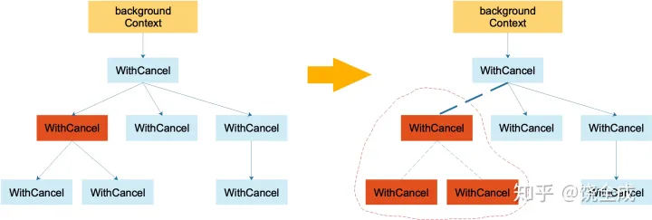

### 上下文context源码解读

#### 什么是 context
Go 1.7 标准库引入 context，中文译作“上下文”，准确说它是 goroutine 的上下文，包含 goroutine 的运行状态、环境、现场等信息。

context 主要用来在 goroutine 之间传递上下文信息，包括：取消信号、超时时间、截止时间、k-v 等。

随着 context 包的引入，标准库中很多接口因此加上了 context 参数，例如 database/sql 包。context 几乎成为了并发控制和超时控制的标准做法。

>context.Context 类型的值可以协调多个 groutine 中的代码执行“取消”操作，并且可以存储键值对。最重要的是它是并发安全的。
与它协作的 API 都可以由外部控制执行“取消”操作，例如：取消一个 HTTP 请求的执行。
取消一个redis的set命令

#### 为什么有 context
Go 常用来写后台服务，通常只需要几行代码，就可以搭建一个 http server。

在 Go 的 server 里，通常每来一个请求都会启动若干个 goroutine 同时工作：有些去数据库拿数据，有些调用下游接口获取相关数据……


这些 goroutine 需要共享这个请求的基本数据，例如登陆的 token，处理请求的最大超时时间（如果超过此值再返回数据，请求方因为超时接收不到）等等。当请求被取消或是处理时间太长，这有可能是使用者关闭了浏览器或是已经超过了请求方规定的超时时间，请求方直接放弃了这次请求结果。这时，所有正在为这个请求工作的 goroutine 需要快速退出，因为它们的“工作成果”不再被需要了。在相关联的 goroutine 都退出后，系统就可以回收相关的资源。

再多说一点，Go 语言中的 server 实际上是一个“协程模型”，也就是说一个协程处理一个请求。例如在业务的高峰期，某个下游服务的响应变慢，而当前系统的请求又没有超时控制，或者超时时间设置地过大，那么等待下游服务返回数据的协程就会越来越多。而我们知道，协程是要消耗系统资源的，后果就是协程数激增，内存占用飙涨，甚至导致服务不可用。更严重的会导致雪崩效应，整个服务对外表现为不可用，这肯定是 P0 级别的事故。

其实前面描述的 P0 级别事故，通过设置“允许下游最长处理时间”就可以避免。例如，给下游设置的 timeout 是 50 ms，如果超过这个值还没有接收到返回数据，就直接向客户端返回一个默认值或者错误。

context 包就是为了解决上面所说的这些问题而开发的：在 一组 goroutine 之间传递共享的值、取消信号、deadline……


用简练一些的话来说，在Go 里，我们不能直接杀死协程，协程的关闭一般会用 channel+select 方式来控制。但是在某些场景下，例如处理一个请求衍生了很多协程，这些协程之间是相互关联的：需要共享一些全局变量、有共同的 deadline 等，而且可以同时被关闭。再用 channel+select 就会比较麻烦，这时就可以通过 context 来实现。

一句话：context 用来解决 goroutine 之间退出通知、元数据传递的功能。

## context 底层实现原理
我们分析的 Go 版本依然是 1.17.11

### 整体概览
context 包的代码并不长，context.go 文件总共 568 行，其中还有很多大段的注释，代码也就 339 行。

先给大家看一张整体的图：


上面这张表展示了 context 的所有函数、接口、结构体，可以纵览全局，可以在读完文章后，再回头细看。

整体类图如下：


## 接口
#### Context
现在可以直接看源码：
```go
type Context interface {
    //当 context 被取消或者到了 deadline，返回一个被关闭的 channel
    Done() <-chan struct{}

    //在 channel Done 关闭后，返回 context 取消原因
    Err() error

    //返回 context 是否会被取消以及自动取消时间（即 deadline）
    Deadline() (deadline time.Time, ok bool)

    //获取 key 对应的 value
    Value(key interface{}) interface{}
}
```

Context 是一个接口，定义了 4 个方法，它们都是幂等的。也就是说连续多次调用同一个方法，得到的结果都是相同的。

Done() 返回一个 channel，可以表示 context 被取消的信号：当这个 channel 被关闭时，说明 context 被取消了。注意，这是一个只读的channel。 我们知道，读一个关闭的 channel 会读出相应类型的零值。并且源码里没有地方会向这个 channel 里面塞入值。换句话说，这是一个 receive-only 的 channel。因此在子协程里读这个 channel，除非被关闭，否则读不出来任何东西。也正是利用了这一点，子协程从 channel 里读出了值（零值）后，就可以做一些收尾工作，尽快退出。

Err() 返回一个错误，表示 channel 被关闭的原因。例如是被取消，还是超时。

Deadline() 返回 context 的截止时间，通过此时间，函数就可以决定是否进行接下来的操作，如果时间太短，就可以不往下做了，否则浪费系统资源。当然，也可以用这个 deadline 来设置一个 I/O 操作的超时时间。

Value() 获取之前设置的 key 对应的 value。

#### canceler
再来看另外一个接口：
```go
type canceler interface {
cancel(removeFromParent bool, err error)
Done() <-chan struct{}
}
```

实现了上面定义的两个方法的 Context，就表明该 Context 是可取消的。源码中有两个类型实现了 canceler 接口：*cancelCtx 和 *timerCtx。注意是加了 * 号的，是这两个结构体的指针实现了 canceler 接口。

Context 接口设计成这个样子的原因：

“取消”操作应该是建议性，而非强制性
caller 不应该去关心、干涉 callee 的情况，决定如何以及何时 return 是 callee 的责任。caller 只需发送“取消”信息，callee 根据收到的信息来做进一步的决策，因此接口并没有定义 cancel 方法。

“取消”操作应该可传递

“取消”某个函数时，和它相关联的其他函数也应该“取消”。因此，Done() 方法返回一个只读的 channel，所有相关函数监听此 channel。一旦 channel 关闭，通过 channel 的“广播机制”，所有监听者都能收到。

## 结构体
#### emptyCtx
源码中定义了 Context 接口后，并且给出了一个实现：
```go
// An emptyCtx is never canceled, has no values, and has no deadline. It is not
// struct{}, since vars of this type must have distinct addresses.
type emptyCtx int

func (*emptyCtx) Deadline() (deadline time.Time, ok bool) {
	return
}

func (*emptyCtx) Done() <-chan struct{} {
	return nil
}

func (*emptyCtx) Err() error {
	return nil
}

func (*emptyCtx) Value(key interface{}) interface{} {
	return nil
}
```

每个函数都实现的异常简单，要么是直接返回，要么是返回 nil。

所以，这实际上是一个空的 context，永远不会被 cancel，没有存储值，也没有 deadline。

它被包装成：

```go
var (
background = new(emptyCtx)
todo       = new(emptyCtx)
)
```
通过下面两个导出的函数（首字母大写）对外公开：
```go
func Background() Context {
return background
}

func TODO() Context {
return todo
}

```

background 通常用在 main 函数中，作为所有 context 的根节点。

todo 通常用在并不知道传递什么 context的情形。例如，调用一个需要传递 context 参数的函数，你手头并没有其他 context 可以传递，这时就可以传递 todo。这常常发生在重构进行中，给一些函数添加了一个 Context 参数，但不知道要传什么，就用 todo “占个位子”，最终要换成其他 context。


#### valueCtx
```go
type valueCtx struct {
Context
key, val interface{}
}
```

它实现了两个方法：

```go
func (c *valueCtx) String() string {
	return contextName(c.Context) + ".WithValue(type " +
		reflectlite.TypeOf(c.key).String() +
		", val " + stringify(c.val) + ")"
}

func (c *valueCtx) Value(key interface{}) interface{} {
	if c.key == key {
		return c.val
	}
	return c.Context.Value(key)
}
```
由于它直接将 Context 作为匿名字段，因此仅管它只实现了 2 个方法，其他方法继承自父 context。但它仍然是一个 Context，这是 Go 语言的一个特点。

创建 valueCtx 的函数：

```go
func WithValue(parent Context, key, val interface{}) Context {
	if parent == nil {
		panic("cannot create context from nil parent")
	}
	if key == nil {
		panic("nil key")
	}
	if !reflectlite.TypeOf(key).Comparable() {
		panic("key is not comparable")
	}
	return &valueCtx{parent, key, val}
}
```
对 key 的要求是可比较，因为之后需要通过 key 取出 context 中的值，可比较是必须的。

通过层层传递 context，最终形成这样一棵树：


和链表有点像，只是它的方向相反：Context 指向它的父节点，链表则指向下一个节点。通过 WithValue 函数，可以创建层层的 valueCtx，存储 goroutine 间可以共享的变量。

取值的过程，实际上是一个递归查找的过程：
```go
func (c *valueCtx) Value(key interface{}) interface{} {
	if c.key == key {
		return c.val
	}
	return c.Context.Value(key)
}
```

它会顺着链路一直往上找，比较当前节点的 key 是否是要找的 key，如果是，则直接返回 value。否则，一直顺着 context 往前，最终找到根节点（一般是 emptyCtx），直接返回一个 nil。所以用 Value 方法的时候要判断结果是否为 nil。

因为查找方向是往上走的，所以，父节点没法获取子节点存储的值，子节点却可以获取父节点的值。

WithValue 创建 context 节点的过程实际上就是创建链表节点的过程。两个节点的 key 值是可以相等的，但它们是两个不同的 context 节点。查找的时候，会向上查找到最后一个挂载的 context 节点，也就是离得比较近的一个父节点 context。所以，整体上而言，用 WithValue 构造的其实是一个低效率的链表。

如果你接手过项目，肯定经历过这样的窘境：在一个处理过程中，有若干子函数、子协程。各种不同的地方会向 context 里塞入各种不同的 k-v 对，最后在某个地方使用。

你根本就不知道什么时候什么地方传了什么值？这些值会不会被“覆盖”（底层是两个不同的 context 节点，查找的时候，只会返回一个结果）？你肯定会崩溃的。

而这也是 context.Value 最受争议的地方。很多人建议尽量不要通过 context 传值。

改进方法：

使用map存储存放的值，gin框架的上下文是这么使用的，大概的代码逻辑：
```go
type valueCtx struct {
	context.Context
	keys sync.Map
}

func (ctx *valueCtx) Value(key interface{}) interface{} {
	v, ok := ctx.keys.Load(key)
	if ok {
		return v
	}
	return ctx.Context.Value(key)
}
```
存放在上下文里面的是一个map,grpc使用这种方式存放数据在上下文里面：
```go
type mdIncomingKey struct{}

// NewIncomingContext creates a new context with incoming md attached.
func NewIncomingContext(ctx context.Context, md MD) context.Context {
	return context.WithValue(ctx, mdIncomingKey{}, md)
}

```

```go
// FromIncomingContext returns the incoming metadata in ctx if it exists.
//
// All keys in the returned MD are lowercase.
func FromIncomingContext(ctx context.Context) (MD, bool) {
	md, ok := ctx.Value(mdIncomingKey{}).(MD)
	if !ok {
		return nil, false
	}
	out := MD{}
	for k, v := range md {
		// We need to manually convert all keys to lower case, because MD is a
		// map, and there's no guarantee that the MD attached to the context is
		// created using our helper functions.
		key := strings.ToLower(k)
		s := make([]string, len(v))
		copy(s, v)
		out[key] = s
	}
	return out, true
}
```


单侧运行
>go test -run=TestUseValue -v
> 
> go test -run=TestUseCtxValue -v


#### cancelCtx
再来看一个最重要的 context：
```go
type cancelCtx struct {
    Context
	//锁，保证原子性
    mu       sync.Mutex            // protects following fields
    //是否已经取消 
	done     atomic.Value          // of chan struct{}, created lazily, closed by first cancel call
	// 保存所有的可以取消的子节点
    children map[canceler]struct{} // set to nil by the first cancel call
	// 错误信息
    err      error                 // set to non-nil by the first cancel call
}
```

这是一个可以取消的 Context，实现了 canceler 接口。它直接将接口 Context 作为它的一个匿名字段，这样，它就可以被看成一个 Context。
先来看是怎么创建一个可以取消的上下文的：
```go
func WithCancel(parent Context) (ctx Context, cancel CancelFunc) {
	if parent == nil {
		panic("cannot create context from nil parent")
	}
	c := newCancelCtx(parent)
	propagateCancel(parent, &c)
	return &c, func() { c.cancel(true, Canceled) }
}

// newCancelCtx returns an initialized cancelCtx.
func newCancelCtx(parent Context) cancelCtx {
	return cancelCtx{Context: parent}
}

// goroutines counts the number of goroutines ever created; for testing.
var goroutines int32

// propagateCancel arranges for child to be canceled when parent is.
func propagateCancel(parent Context, child canceler) {
	done := parent.Done()
	if done == nil {
		return // parent is never canceled
	}

	select {
	case <-done:
		// parent is already canceled
		child.cancel(false, parent.Err())
		return
	default:
	}

	if p, ok := parentCancelCtx(parent); ok {
		p.mu.Lock()
		if p.err != nil {
			// parent has already been canceled
			child.cancel(false, p.err)
		} else {
			if p.children == nil {
				p.children = make(map[canceler]struct{})
			}
			p.children[child] = struct{}{}
		}
		p.mu.Unlock()
	} else {
		atomic.AddInt32(&goroutines, +1)
		go func() {
			select {
			case <-parent.Done():
				child.cancel(false, parent.Err())
			case <-child.Done():
			}
		}()
	}
}

// &cancelCtxKey is the key that a cancelCtx returns itself for.
var cancelCtxKey int

// parentCancelCtx returns the underlying *cancelCtx for parent.
// It does this by looking up parent.Value(&cancelCtxKey) to find
// the innermost enclosing *cancelCtx and then checking whether
// parent.Done() matches that *cancelCtx. (If not, the *cancelCtx
// has been wrapped in a custom implementation providing a
// different done channel, in which case we should not bypass it.)
func parentCancelCtx(parent Context) (*cancelCtx, bool) {
	done := parent.Done()
	if done == closedchan || done == nil {
		return nil, false
	}
	p, ok := parent.Value(&cancelCtxKey).(*cancelCtx)
	if !ok {
		return nil, false
	}
	//先判断Value方法获取到的是不是cancelCtx，自定义的上下文可以通过继承来获取到,
	//这里的判断是判断父级的通道和通过上下文树找到的cancelCtx的通道是不是同一个（指针对比）
	pdone, _ := p.done.Load().(chan struct{})
	if pdone != done {
		return nil, false
	}
	return p, true
}
```
这是一个暴露给用户的方法，传入一个父 Context（这通常是一个 background，作为根节点），返回新建的 context，新 context 的 done channel 是新建的。

当 WithCancel 函数返回的 CancelFunc 被调用或者是父节点的 done channel 被关闭（父节点的 CancelFunc 被调用），此 context（子节点） 的 done channel 也会被关闭。

注意传给 WithCancel 方法的参数，前者是 true，也就是说取消的时候，需要将自己从父节点里删除。第二个参数则是一个固定的取消错误类型：

>var Canceled = errors.New("context canceled")
> 
还注意到一点，调用子节点 cancel 方法的时候，传入的第一个参数 removeFromParent 是 false。

两个问题需要回答：1. 什么时候会传 true？2. 为什么有时传 true，有时传 false？

当 removeFromParent 为 true 时，会将当前节点的 context 从父节点 context 中删除：

最关键的一行：

>delete(p.children, child)

什么时候会传 true 呢？答案是调用 WithCancel() 方法的时候，也就是新创建一个可取消的 context 节点时，返回的 cancelFunc 函数会传入 true。这样做的结果是：当调用返回的 cancelFunc 时，会将这个 context 从它的父节点里“除名”，因为父节点可能有很多子节点，你自己取消了，所以我要和你断绝关系，对其他人没影响。

在取消函数内部，我知道，我所有的子节点都会因为我的一：c.children = nil 而化为灰烬。我自然就没有必要再多做这一步，最后我所有的子节点都会和我断绝关系，没必要一个个做。另外，如果遍历子节点的时候，调用 child.cancel 函数传了 true，还会造成同时遍历和删除一个 map 的境地，会有问题的。
>go test -v -run=TestUseMap  map并发不是安全的

这个parentCancelCtx方法的作用就是向上寻找可以“挂靠”的“可取消”的 context，并且“挂靠”上去。这样，调用上层 cancel 方法的时候，就可以层层传递，将那些挂靠的子 context 同时“取消”。

这里着重解释下为什么会有 else 描述的情况发生。else 是指当前节点 context 没有向上找到可以取消的父节点，那么就要再启动一个协程监控父节点或者子节点的取消动作。

这里就有疑问了，既然没找到可以取消的父节点，那 case <-parent.Done() 这个 case 就永远不会发生，所以可以忽略这个 case；而 case <-child.Done() 这个 case 又啥事不干。那这个 else 不就多余了吗？

其实不然。我们回看下 parentCancelCtx 的代码。这个方法是看父context是不是cancelCtxKey，因为Context是接口，可以自定义上下文的，使用自定义上下文需要注意这些问题：

实现了Done() <-chan struct{}方法而又返回nil的话，会导致上下文树取消有问题：
```go
type valueCtx struct {
	context.Context
	keys sync.Map
}

func (ctx *valueCtx) Value(key interface{}) interface{} {
	v, ok := ctx.keys.Load(key)
	if ok {
		return v
	}
	return ctx.Context.Value(key)
}

func (ctx *valueCtx) Done() <-chan struct{} {
	return nil
}

```
使用case：
>go test -v -run=TestUseParentNil

如果需要自定义实现可以取消的上下文，大概逻辑得是这样的，开启一个协程监听父级上下文状态：
```go

type ctxCancel struct {
	context.Context
	mu   sync.Mutex
	done chan struct{}
	err  error
}

func (m *ctxCancel) Watch() {
	go func() {
		select {
		case <-m.Context.Done():
			//m.Done()
			m.Close()
		case <-m.Done():

		}
	}()
}


func (m *ctxCancel) Done() <-chan struct{} {
	m.mu.Lock()
	defer m.mu.Unlock()
	if nil == m.done {
		m.done = make(chan struct{})
	}
	return m.done
}
```
再来说一下，select 语句里的两个 case 其实都不能删。

```go
select {
case <-parent.Done():
    child.cancel(false, parent.Err())
case <-child.Done():
}
```
第一个 case 说明当父节点取消，则取消子节点。如果去掉这个 case，那么父节点取消的信号就不能传递到子节点。

第二个 case 是说如果子节点自己取消了，那就退出这个 select，父节点的取消信号就不用管了。如果去掉这个 case，那么很可能父节点一直不取消，这个 goroutine 就泄漏了。当然，如果父节点取消了，就会重复让子节点取消，不过，这也没什么影响嘛。





如上左图，代表一棵 context 树。当调用左图中标红 context 的 cancel 方法后，该 context 从它的父 context 中去除掉了：实线箭头变成了虚线。且虚线圈框出来的 context 都被取消了，圈内的 context 间的父子”取消“关系都荡然无存了，但是上下文树关系还是存在的。


来看 Done() 方法的实现：
```go
func (c *cancelCtx) Done() <-chan struct{} {
	d := c.done.Load()
	if d != nil {
		return d.(chan struct{})
	}
	c.mu.Lock()
	defer c.mu.Unlock()
	d = c.done.Load()
	if d == nil {
		d = make(chan struct{})
		c.done.Store(d)
	}
	return d.(chan struct{})
}
```

c.done 是“懒汉式”创建，只有调用了 Done() 方法的时候才会被创建。再次说明，函数返回的是一个只读的 channel，而且没有地方向这个 channel 里面写数据。所以，直接调用读这个 channel，协程会被 block 住。一般通过搭配 select 来使用。一旦关闭，就会立即读出零值。
>向一个close的chan写入会panic,读取不会
> 
> go test -v -run=TestUseCloseChan


Err() 方法：
```go
func (c *cancelCtx) Err() error {
	c.mu.Lock()
	err := c.err
	c.mu.Unlock()
	return err
}
```
这个方法是可以使用defer优化的，并且之前的版本就是这样的：
```go
func (c *cancelCtx) Err() error {
	c.mu.Lock()
	defer c.mu.Unlock()
	return c.err
}
```
为什么改为现在这样，主要原因是性能考量，defer能够很好地优化代码结构，但defer是有性能损耗的
>go test -v -run="noce" -bench=. -benchtime=10s


接下来，我们重点关注 cancel() 方法的实现：

```go
func (c *cancelCtx) cancel(removeFromParent bool, err error) {
// 必须要传 err
if err == nil {
panic("context: internal error: missing cancel error")
}
c.mu.Lock()
if c.err != nil {
c.mu.Unlock()
return // 已经被其他协程取消
}
// 给 err 字段赋值
c.err = err
// 关闭 channel，通知其他协程
if c.done == nil {
c.done = closedchan
} else {
close(c.done)
}

    // 遍历它的所有子节点
    for child := range c.children {
        // 递归地取消所有子节点
        child.cancel(false, err)
    }
    // 将子节点置空
    c.children = nil
    c.mu.Unlock()

    if removeFromParent {
        // 从父节点中移除自己 
        removeChild(c.Context, c)
    }
}
```

总体来看，cancel() 方法的功能就是关闭 channel：c.done；递归地取消它的所有子节点；从父节点从删除自己。达到的效果是通过关闭 channel，将取消信号传递给了它的所有子节点。goroutine 接收到取消信号的方式就是 select 语句中的读 c.done 被选中。


#### timerCtx
timerCtx 基于 cancelCtx，只是多了一个 time.Timer 和一个 deadline。Timer 会在 deadline 到来时，自动取消 context。

```go
// A timerCtx carries a timer and a deadline. It embeds a cancelCtx to
// implement Done and Err. It implements cancel by stopping its timer then
// delegating to cancelCtx.cancel.
type timerCtx struct {
	cancelCtx
	timer *time.Timer // Under cancelCtx.mu.

	deadline time.Time
}
```
timerCtx 首先是一个 cancelCtx，所以它能取消。看下 cancel() 方法：

```go
func (c *timerCtx) cancel(removeFromParent bool, err error) {
	c.cancelCtx.cancel(false, err)
	if removeFromParent {
		// Remove this timerCtx from its parent cancelCtx's children.
		removeChild(c.cancelCtx.Context, c)
	}
	c.mu.Lock()
	if c.timer != nil {
		c.timer.Stop()
		c.timer = nil
	}
	c.mu.Unlock()
}
```
创建 timerCtx 的方法：

```go
func WithTimeout(parent Context, timeout time.Duration) (Context, CancelFunc) {
	return WithDeadline(parent, time.Now().Add(timeout))
}
```

```go

func WithDeadline(parent Context, d time.Time) (Context, CancelFunc) {
	if parent == nil {
		panic("cannot create context from nil parent")
	}
	if cur, ok := parent.Deadline(); ok && cur.Before(d) {
		// The current deadline is already sooner than the new one.
		return WithCancel(parent)
	}
	c := &timerCtx{
		cancelCtx: newCancelCtx(parent),
		deadline:  d,
	}
	propagateCancel(parent, c)
	dur := time.Until(d)
	if dur <= 0 {
		c.cancel(true, DeadlineExceeded) // deadline has already passed
		return c, func() { c.cancel(false, Canceled) }
	}
	c.mu.Lock()
	defer c.mu.Unlock()
	if c.err == nil {
		c.timer = time.AfterFunc(dur, func() {
			c.cancel(true, DeadlineExceeded)
		})
	}
	return c, func() { c.cancel(true, Canceled) }
}
```
也就是说仍然要把子节点挂靠到父节点，一旦父节点取消了，会把取消信号向下传递到子节点，子节点随之取消。

有一个特殊情况是，如果要创建的这个子节点的 deadline 比父节点要晚，也就是说如果父节点是时间到自动取消，那么一定会取消这个子节点，导致子节点的 deadline 根本不起作用，因为子节点在 deadline 到来之前就已经被父节点取消了。

这个函数的最核心的一句是：

```go
c.timer = time.AfterFunc(dur, func() {
			c.cancel(true, DeadlineExceeded)
		})
```
c.timer 会在 d 时间间隔后，自动调用 cancel 函数，并且传入的错误就是 DeadlineExceeded：

```go
var DeadlineExceeded error = deadlineExceededError{}

type deadlineExceededError struct{}

func (deadlineExceededError) Error() string   { return "context deadline exceeded" }
func (deadlineExceededError) Timeout() bool   { return true }
func (deadlineExceededError) Temporary() bool { return true }
```


## 如何使用 context
context 使用起来非常方便。源码里对外提供了一个创建根节点 context 的函数：
```go
func Background() Context
```
background 是一个空的 context， 它不能被取消，没有值，也没有超时时间。

有了根节点 context，又提供了四个函数创建子节点 context：
```go
func WithCancel(parent Context) (ctx Context, cancel CancelFunc)
func WithDeadline(parent Context, deadline time.Time) (Context, CancelFunc)
func WithTimeout(parent Context, timeout time.Duration) (Context, CancelFunc)
func WithValue(parent Context, key, val interface{}) Context
```

context 会在函数传递间传递。只需要在适当的时间调用 cancel 函数向 goroutines 发出取消信号或者调用 Value 函数取出 context 中的值。

在官方博客里，对于使用 context 提出了几点建议：

Do not store Contexts inside a struct type; instead, pass a Context explicitly to each function that needs it. The Context should be the first parameter, typically named ctx.
Do not pass a nil Context, even if a function permits it. Pass context.TODO if you are unsure about which Context to use.
Use context Values only for request-scoped data that transits processes and APIs, not for passing optional parameters to functions.
The same Context may be passed to functions running in different goroutines; Contexts are safe for simultaneous use by multiple goroutines.

我翻译一下：

不要将 Context 塞到结构体里。直接将 Context 类型作为函数的第一参数，而且一般都命名为 ctx。
不要向函数传入一个 nil 的 context，如果你实在不知道传什么，标准库给你准备好了一个 context：todo。
不要把本应该作为函数参数的类型塞到 context 中，context 存储的应该是一些共同的数据。例如：登陆的 session、cookie 等。
同一个 context 可能会被传递到多个 goroutine，别担心，context 是并发安全的。
传递共享的数据


## 总结
到这里，整个 context 包的内容就全部讲完了。源码非常短，很适合学习，一定要去读一下。

context 包是 Go 1.7 引入的标准库，主要用于在 goroutine 之间传递取消信号、超时时间、截止时间以及一些共享的值等。它并不是太完美，但几乎成了并发控制和超时控制的标准做法。

使用上，先创建一个根节点的 context，之后根据库提供的四个函数创建相应功能的子节点 context。由于它是并发安全的，所以可以放心地传递。

当使用 context 作为函数参数时，直接把它放在第一个参数的位置，并且命名为 ctx。另外，不要把 context 嵌套在自定义的类型里。

最后，大家下次在看到代码里有用到 context 的，观察下是怎么使用的，肯定逃不出我们讲的几种类型。熟悉之后会发现：context 可能并不完美，但它确实简洁高效地解决了问题。